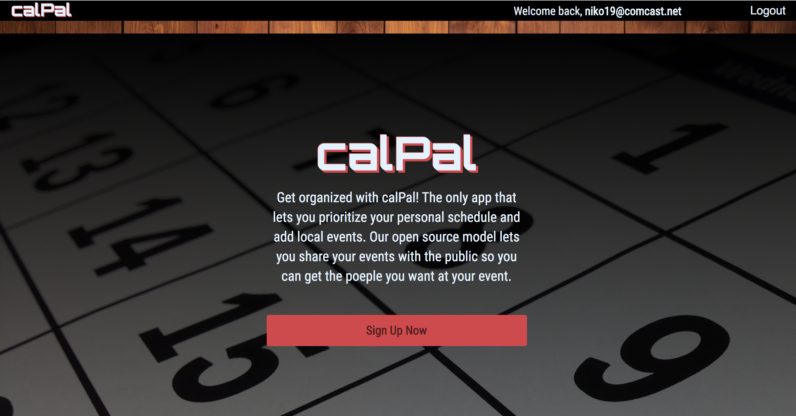

# calPal App

# Usages
calPal helps users keep their events organized and prioritized. Users can browse our built in API data for event suggestions or create their own pulbic schedules to increase event attendance.

# Meta
Distributed under the ISC license. See LICENSE for more information.

https://github.com/Jhint24/VoluntArea

# Contributing
Fork it (https://github.com/nsanta11/calPal/fork)

# Current Contributors
Chay Dahill @ https://github.com/cfdahill/

Chad Plourde @ https://github.com/Cdplourde

Nicole Santarsiero @ https://github.com/nsanta11

# MERN STARTER
This is a MERN skeleton that connects a Node.js (Express )back-end with a React.js (create-react-app) front-end.
https://github.com/mmarovich/MERN-starter

To use: 

 1. Fork and/or clone repository
 2. Change remote: ``git remote set-url origin git://new.url.here``
 3. cd into folder
 4. ``yarn start`` will run both front-end and back-end
 5. Happy coding

Feel free to request any features, but I'd like to keep it as bare-bones as possible.
